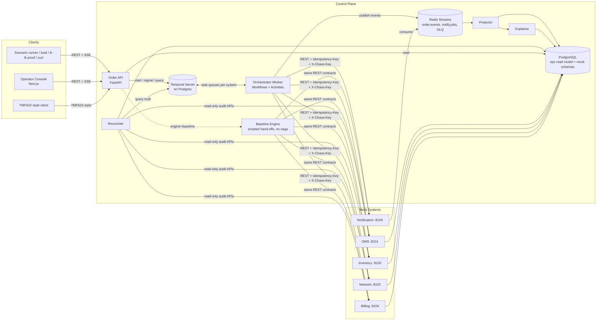

# ARCHITECTURE — SwitchOn (v2)

## 1. Style
**Orchestrated saga on a durable workflow engine (Temporal).** One `ServiceActivationWorkflow` per order owns control flow. Downstream systems are called **only** from activities. Progress is published as events and projected to a read model (CQRS-lite). **Temporal is the source of truth**; everything else is derived and rebuildable.

## 2. System Context (save as `docs/architecture.mmd`)



## 3. Components

| Component | Responsibility | Never does |
|---|---|---|
| **Order API** | Validate/accept orders, idempotency, plan resolution & snapshot, start workflow, reads/SSE/metrics, operator signals, TMF façade, certificates, demo endpoints | Call mock systems for orchestration |
| **Orchestrator Worker** | Workflow logic; activities (forward + compensation); event publishing | I/O inside workflow code |
| **Baseline Engine** | Honest control: sequential scripted pipeline, small fixed retries, **no compensation** — what manual/scripted hand-offs do today (X1) | Use Temporal or saga logic |
| **Projector** | Consume events → `ops.*` (idempotent, DLQ on poison); seals certificates at terminal states | Decide business outcomes |
| **Reconciler** (X4) | Periodically compare each system's resources to the set of orders' intended state; classify drift (orphan / missing / mismatch); auto-repair safe cases via compensation; escalate rest | Mutate systems outside the compensation API |
| **Explainer** (X7) | Deterministic rules → cause/impact/action for failed orders | Required LLM calls |
| **Mocks** | Stateful, idempotent, tombstone-aware, chaos-capable fake systems | Know about each other or the orchestrator |
| **Console** | Live views, actions, proof pages | Hold business logic |

## 4. Order Decomposition

`catalog/products/fiber_500.yaml`:

```yaml
product: FIBER_500
version: 3
tasks:
  - id: validate_order
    system: oms
    action: validate
    read_only: true
    retry: {max_attempts: 3, initial: 1s, backoff: 2.0, max_interval: 8s}
    timeout: 10s
  - id: reserve_inventory
    system: inventory
    action: reserve
    depends_on: [validate_order]
    compensation: release
  - id: provision_network
    system: network
    action: provision
    depends_on: [reserve_inventory]
    compensation: deprovision
    timeout: 20s
  - id: create_billing_account
    system: billing
    action: create_account
    depends_on: [reserve_inventory]        # parallel with provision_network
    compensation: void_account
  - id: verify_service
    system: network
    action: verify
    depends_on: [provision_network, create_billing_account]
    read_only: true
  - id: start_billing
    system: billing
    action: start_charging
    depends_on: [verify_service]           # never bill before service is verified
    compensation: reverse_charges
  - id: complete_order
    system: oms
    action: complete
    depends_on: [start_billing]
    compensation: reopen_order
  - id: notify_customer
    system: notification
    action: send_activation
    depends_on: [start_billing]
    best_effort: true                      # failure never rolls back a live service
```


**Business ordering rules (validator-enforced):** money starts last; the customer is told only after billing starts; the order closes only after the service is verified and billed.

**Catalog validator rejects:** cycles, unknown deps/systems/actions, a mutating task without compensation (unless `best_effort`), `start_charging` not downstream of a `verify` task, a `notify` task upstream of billing start.

**Plan resolution:** the API resolves the catalog to a `Plan` (topologically sorted waves + per-task policy), stores it in `ops.orders.plan_json` with `catalog_version`, and passes it as workflow input. Workflows never read the catalog.

## 5. Workflow Design

```
ServiceActivationWorkflow(order, plan)
  state: task_states, completion_order[], attempted_effects[], cancel_requested, outcome
  loop until no runnable tasks or failure:
    ready = tasks with all deps SUCCEEDED and state PENDING
    run all ready concurrently (activities on the task's system queue)
    success        -> task SUCCEEDED; if mutating: completion_order.append(task)
    retries exhausted / non-retryable (task not best_effort)
                   -> task FAILED; if outcome was UNKNOWN (timeout/conn-loss): attempted_effects.append(task)
                   -> stop scheduling; goto ROLLBACK
    best_effort failure -> task FAILED, continue
    cancel signal  -> stop scheduling after current wave; goto ROLLBACK (terminal CANCELLED)
  ROLLBACK:
    targets = reverse(completion_order) + attempted_effects (ambiguous-outcome tasks, undone first)
    for task in targets with compensation: run compensation activity (own policy; more attempts)
        failure after exhaustion -> COMPENSATION_FAILED; continue remaining; outcome NEEDS_ATTENTION
    best-effort failure notification to customer
    outcome = ROLLED_BACK | CANCELLED | NEEDS_ATTENTION
  finalize: publish terminal event (projector seals certificate)
  signals: cancel_order(reason) · retry_compensation(task_id) · resolve_manually(task_id, note)
  query:   get_state()  (UI reconciliation snapshot)
```

Properties: deterministic (plan is input; all time/uuid via workflow APIs); parallel branches compensate safely because compensation follows reverse **completion** order and every undo is independently idempotent.

## 6. Exactly-Once Effects: Idempotency, Tombstones, Unknown Outcomes

### 6.1 Idempotency
- Key: `{order_id}:{task_id}:{action}`; compensation: `{order_id}:{task_id}:{compensation}`.
- Mocks persist `(key → response)`; replays return the stored response with header `Idempotent-Replay: true` and **never apply the effect twice**.
- Order API: unique `client_order_ref` (`INSERT … ON CONFLICT DO NOTHING` then read-back) → concurrent duplicates resolve to one order. `workflow_id = order-{order_id}` with `REJECT_DUPLICATE`.

### 6.2 The late-arrival race (and the fix) — X3
**Hazard:** forward call times out client-side but is still in flight → workflow rolls back → compensation finds nothing to undo and reports success → the delayed forward request then lands and creates an **orphan**.

**Fix — tombstone, cancel-wins:**
1. Every compensation call writes a **tombstone** for the *forward* idempotency key (even if the resource doesn't exist yet).
2. Every forward endpoint checks tombstones first (same transaction as the effect): tombstoned key → reject with `409 TOMBSTONED`, no effect.
3. Tombstones are retained ≥ the maximum activity schedule-to-close window plus margin.

Scenario S11 proves this: seeded `delay_forward` chaos + forced timeout → compensation first → late forward is rejected → invariant passes.

### 6.3 Unknown outcomes
A timeout/connection loss after the last retry means the effect may or may not exist. Such tasks are added to `attempted_effects` and **compensated** (tombstone + undo). Business errors (`OUT_OF_STOCK`) are *known-not-applied* and are not compensated.

### 6.4 Error taxonomy

| Class | Examples | Retry | After exhaustion |
|---|---|---|---|
| `TransientError` | 502/503/504, timeout, reset | Yes (backoff + jitter) | Task FAILED (outcome UNKNOWN if timeout) → rollback |
| `BusinessError` | `OUT_OF_STOCK`, `INVALID_ADDRESS`, `CREDIT_REJECTED` | **No** | Task FAILED (known-not-applied) → rollback |
| `PermanentSystemError` | 500 `CONFIG_REJECTED` | Limited | Rollback |
| `CompensationError` | undo failed | Yes (higher cap) | `NEEDS_ATTENTION` |

## 7. Events, Projection, and Dual-Write Safety

Stream `order.events`, envelope:

```json
{"event_id":"uuid","order_id":"ord_123","seq":14,"ts":"2026-10-08T10:15:30.123Z",
 "type":"task.retrying","task_id":"provision_network","system":"network",
 "attempt":2,"state":"RETRYING","detail":{"error":"503","next_retry_in_ms":2000}}
```

- **Who publishes:** each activity publishes `task.started` at entry, `task.retrying` (with `activity.info().attempt`) in its failure path before re-raising, and `task.succeeded` on success; the workflow publishes `task.failed`, `task.compensating|compensated|compensation_failed` and `order.*` through a `publish_event` activity.
- **Delivery:** at-least-once. `event_id` unique; `(order_id, seq)` ordering; projector dedupes and upserts idempotently. `seq` is assigned from workflow state for order-level events and from `(task_id, attempt)` ordering for task events; the projector orders by `seq` then `ts`.
- **Dual-write safety:** if an effect succeeds but event publish fails, the activity fails and retries — safe because the effect is idempotent. If events are ever lost, the **`get_state` query** plus the Reconciler repair the read model (Temporal remains the truth).
- Poison messages → `order.events.dlq`; projector never crash-loops.

## 8. Consistency Certificate (X2)

At terminal state the projector (or Order API, on first request) seals:

```json
{
  "order_id":"ord_123","outcome":"ROLLED_BACK","catalog_version":3,
  "events_digest":"sha256:…",             // hash chain over ordered events: h_i = SHA256(h_{i-1} || canonical(event_i))
  "system_state":{                          // read-only audit calls AFTER terminal
    "inventory":{"reservations":0},"network":{"services":0},
    "billing":{"accounts":0,"active_charges":0},"oms":{"status":"FAILED"}
  },
  "invariants":[{"id":"INV-2","result":"PASS"}],
  "issued_at":"…","signature":"ed25519:…","key_id":"dev-1"
}
```

- Canonical JSON (sorted keys, no whitespace) before hashing/signing.
- `GET /orders/{id}/certificate`, `POST /certificates/verify`, offline `scripts/verify_cert.py` (recomputes the chain from exported events and checks the signature).
- Tampering with any event or the state digest makes verification fail — demonstrated live.
- Claim scope: certificate attests *the audited state at issue time and the recorded event history*, not omniscience about the real world (stated in the report).

## 9. A/B Proof Harness (X1)

**Purpose:** quantify what SwitchOn prevents, fairly.
- **Baseline engine** = sequential pipeline calling the same mock APIs in the order a typical script would, small fixed retry (3 attempts), and on failure simply stops/logs (no compensation). It gets the *same* retry budget — we do not strawman.
- **Deterministic faults:** orders carry `chaos_key` (`{seed}-{index}`) sent as `X-Chaos-Key`. Mocks decide faults from a pure function `f(seed, chaos_key, action, call_count_for_key)` — so both engines face *identical* fault schedules.
- **Leak metrics** (computed by the invariant checker from mock DBs): `billed_without_service`, `service_without_billing`, `orphaned_resources`, `stuck_orders`.
- `scripts/ab_proof.py --orders 200 --seed 42 --mix default` prints a side-by-side table and writes `docs/ab-proof.json`; console page renders it live.

## 10. Reconciler (X4)

Every N seconds (and on demand): for each mock, call read-only `GET /admin/audit/resources`; join to `ops.orders`/Temporal states.

| Drift class | Detection | Action |
|---|---|---|
| **Orphan** | resource exists, order is terminal-failed or unknown | Safe auto-compensate (idempotent), record event |
| **Missing** | order ACTIVE but resource absent | Escalate to fallout queue |
| **Mismatch** | state differs from expected | Escalate |
| **Stuck** | order IN_PROGRESS beyond p99 × factor with no events | Flag; link Temporal history |

## 11. Root-Cause Explainer (X7)
Rules table `(system, error_code, task_phase) → {cause, customer_impact, recommended_action, owner}`; for rollbacks adds "what was undone" from compensation events. Output stored on `ops.orders.explanation` and shown in console. Optional `EXPLAINER_LLM=true` may *paraphrase* the deterministic explanation; never required, never on the critical path, output labeled "AI-paraphrased".

## 12. Chaos & Mock Contract

Each mock implements: domain endpoints, **forward + undo (+ tombstone)**, `Idempotency-Key` handling, `/admin/chaos` (PUT/GET/DELETE), `/admin/audit/resources` (read-only), `/healthz`, `/metrics`.

```json
{"mode":"fail_n","n":2,"status":503,"match":{"action":"provision"},
 "latency_ms":{"min":100,"max":400}}
```
Modes: `none | fail_n | always_fail | random(p) | timeout | slow | business_error(code) | delay_forward(ms) | fail_on_compensation | seeded`. Chaos is **off at boot**; `DELETE /admin/chaos` resets.

## 13. Data Model (`ops` read model)

- `ops.orders(order_id PK, client_order_ref UNIQUE, customer_id, product, catalog_version, plan_json, engine, state, created_at, completed_at, activation_ms, failure_reason, explanation JSONB, workflow_id, chaos_key)`
- `ops.tasks(order_id, task_id, system, state, attempts, started_at, ended_at, last_error, outcome_known BOOL, PK(order_id, task_id))`
- `ops.events(order_id, seq, event_id UNIQUE, ts, type, task_id, payload JSONB)`
- `ops.system_calls(id, order_id, task_id, system, direction, request, response, status_code, latency_ms, ts)`
- `ops.certificates(order_id PK, body JSONB, signature, key_id, issued_at)`
- `ops.drift(id, detected_at, system, resource_ref, class, order_id, action, resolved_at)`
- Mock schemas: `inventory.resources`, `network.services`, `billing.accounts/charges`, `oms.orders`, `notify.messages`; each with `idempotency` and `tombstones` tables.

PII masking applies before persisting payloads (RULES §7).

## 14. API Surface

**Order API:** `POST /orders` · `GET /orders` · `GET /orders/{id}` · `GET /orders/{id}/events?upto_seq=` (time-travel) · `GET /orders/{id}/certificate` · `POST /certificates/verify` · `POST /orders/{id}/cancel` · `POST /orders/{id}/tasks/{task}/retry-compensation` · `POST /orders/{id}/resolve` · `GET /stream/orders` · `GET /stream/orders/{id}` · `GET /catalog/products` · `GET /catalog/products/{p}/rollback-preview` · `GET /systems/health` · `GET /systems/{s}/blast-radius` · `GET /metrics/summary|timeseries` · `GET /metrics` (Prometheus) · `GET /drift` · `POST /reconcile` · demo: `POST /demo/scenarios/{name}`, `POST /demo/load`, `POST /demo/ab-proof`, `GET /demo/invariants`.
**TMF façade (X8):** `POST /tmf-api/productOrderingManagement/v4/productOrder`, `GET …/productOrder/{id}`.
**Mocks:** forward/undo per system (e.g., Inventory `POST /reservations`, `DELETE /reservations/{id}`; Network `POST /services`, `DELETE /services/{id}`, `POST /services/{id}/verify`; Billing `POST /accounts`, `DELETE /accounts/{id}`, `POST /accounts/{id}/charging`, `POST /accounts/{id}/charging/reverse`; OMS `POST /orders/validate`, `POST /orders/{id}/complete`, `POST /orders/{id}/reopen`; Notification `POST /messages`).
Errors: RFC 7807 problem JSON.

## 15. Metrics Definitions (single source — no alternates anywhere)

- **Activation time** = `completed_at − created_at` for `ACTIVE` orders (p50/p95/p99).
- **Success rate** = `ACTIVE / (ACTIVE + ROLLED_BACK + NEEDS_ATTENTION)`; `CANCELLED` excluded (operator intent ≠ failure).
- **Clean-rollback rate** = `ROLLED_BACK / (ROLLED_BACK + NEEDS_ATTENTION)`.
- **Consistency rate** = orders whose certificate invariants all PASS / terminal orders (**target 100%**).
- Also: retries per order, per-system error rate and p95 latency, in-flight count, `NEEDS_ATTENTION` count, time-to-resolution for failures.

## 16. Operator Console

1. **Overview** — KPI cards, live orders table, trends, system health + breaker state.
2. **Order Detail** — live DAG (grey pending · blue running · amber retrying · green done · red failed · purple compensating · slate compensated), **Replay slider (X5)**, **Rollback Preview on hover (X6)**, timeline, payload drawer, **Explainer card (X7)**, **Certificate panel with Verify (X2)**, actions, Temporal deep link.
3. **Chaos & Scenarios** — per-system chaos toggles, S1–S12 buttons, load generator.
4. **Proof** — A/B results (X1), invariant results, drift report (X4), certificate tamper demo.
5. **Metrics** — histograms, trends, per-system health, blast radius.
6. **Catalog** — product DAGs from YAML.
Live updates: SSE snapshot-then-delta with `Last-Event-ID`; reconcile via `GET /orders/{id}` on reconnect. State is never conveyed by color alone (icon + text).

## 17. System-Level Failure Handling

| Failure | Handling |
|---|---|
| Worker crash | Another worker replays; activities idempotent |
| Order API crash | Stateless; client retries with `client_order_ref` |
| Redis down | Orchestration continues; event publish retried; UI reconciles via query/DB |
| Postgres (read model) down | Orchestration unaffected; projector retries; console shows degraded banner |
| Temporal down | API returns 503 with retry hint; no partial orders (order row written only after workflow start succeeds, or marked `RECEIVED` and retried by API sweeper) |
| Mock down | Retries → rollback; breaker opens (P1) |
| Duplicate/out-of-order events | Projector dedupes, orders by `seq` |
| Poison event | DLQ |
| Workflow code changes with in-flight orders | `workflow.patched()` versioning + replay test |

## 18. Security
`X-API-Key` on operator/admin routes, CORS allowlist, strict validation, masked identifiers, secrets via env only, Ed25519 dev keys generated locally (never committed). Roadmap: OIDC, RBAC, mTLS.

## 19. Scalability Narrative
Stateless API/workers scale horizontally; **task queue per system** enables independent worker pools, rate limits, and bulkheads; Redis consumer groups scale projectors; read model partitionable by time; swap mocks for real systems by changing `SystemClient` implementations.

## 20. ADR Index
1. Temporal over Airflow/Camunda. 2. Orchestration over choreography. 3. Plan-as-input. 4. Billing last; notification best-effort. 5. At-least-once events + idempotent projector; Temporal is truth. 6. REST mocks with idempotency. 7. **Tombstone compensation** for late-arrival races. 8. **Unknown-outcome ⇒ compensate.** 9. **Baseline gets equal retry budget** (fair A/B). 10. **Deterministic seeded faults** keyed by `X-Chaos-Key`. 11. **Signed hash-chained certificates.** 12. **`temporalio/server` + `admin-tools`**, not deprecated auto-setup.
