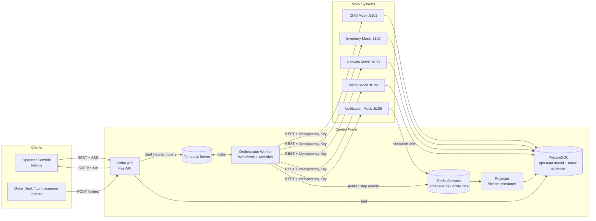
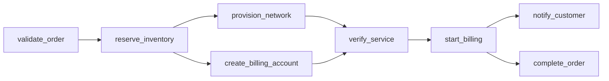

# ARCHITECTURE — SwitchOn

## 1. Architectural Style
**Orchestrated Saga** on a durable workflow engine (Temporal). A single `ServiceActivationWorkflow` per order owns control flow; downstream systems are called only through **activities** (side-effect boundary). Status is published as **events** to a stream and projected into a read model for the operator console (CQRS-lite).

## 2. System Context Diagram (Mermaid — save as `docs/architecture.mmd`)



## 3. Components

| Component | Responsibility | Never does |
|---|---|---|
| **Order API** | Validate/accept orders, idempotency check, start workflow, expose reads/SSE/metrics, relay operator signals | Call mock systems directly |
| **Orchestrator Worker** | Workflow logic (plan, parallelism, saga), activities (one per system action + compensation), event publishing | Block on I/O inside workflow code |
| **Projector** | Consume `order.events`, upsert `ops.orders`, `ops.tasks`, append `ops.events`, push to SSE hub | Make business decisions |
| **Mock Systems** | Behave like real systems: stateful, idempotent, latency, chaos hooks | Know about each other |
| **Temporal** | Durable state, timers, retries, history | Store business read models |
| **Operator Console** | Live list, DAG, timeline, chaos panel, metrics | Hold business logic |

## 4. Order Decomposition

Catalog YAML defines the graph. Example `catalog/products/fiber_500.yaml`:

```yaml
product: FIBER_500
version: 3
tasks:
  - id: validate_order
    system: oms
    action: validate
    compensation: null
    retry: {max_attempts: 3, initial: 1s, backoff: 2.0, max_interval: 8s}
    timeout: 10s
  - id: reserve_inventory
    system: inventory
    action: reserve
    depends_on: [validate_order]
    compensation: release
  - id: provision_network
    system: network
    action: provision
    depends_on: [reserve_inventory]
    compensation: deprovision
    timeout: 20s
  - id: create_billing_account
    system: billing
    action: create_account
    depends_on: [reserve_inventory]      # parallel with provision_network
    compensation: void_account
  - id: verify_service
    system: network
    action: verify
    depends_on: [provision_network, create_billing_account]
    compensation: null                   # read-only
  - id: start_billing
    system: billing
    action: start_charging
    depends_on: [verify_service]         # never bill before service verified
    compensation: reverse_charges
  - id: notify_customer
    system: notification
    action: send_activation
    depends_on: [start_billing]
    compensation: null                   # best-effort; failure does NOT roll back
    best_effort: true
  - id: complete_order
    system: oms
    action: complete
    depends_on: [start_billing]
    compensation: reopen_order
```

### Resulting DAG



**Design rule:** *money starts last, customer is told after the money starts, and the order closes only when the service is verified and billed.*

## 5. Workflow Design

```
ServiceActivationWorkflow(order, plan)
  state: task_states, completed_stack (ordered by completion), cancel_requested
  loop:
    ready = tasks whose deps SUCCEEDED and state PENDING
    run all ready tasks concurrently (asyncio.gather over activities)
    on task success  -> push to completed_stack, emit event
    on retryable err -> Temporal RetryPolicy handles; emit RETRYING events via activity heartbeat/publisher
    on non-retryable or retries exhausted (and task not best_effort):
        -> mark FAILED, stop scheduling, go to ROLLBACK
  ROLLBACK:
    for task in reverse(completed_stack) with compensation != null:
        run compensation activity (own retry policy, more attempts, idempotent)
        on exhaustion -> COMPENSATION_FAILED, continue others, final state NEEDS_ATTENTION
    send failure notification (best effort)
    final state ROLLED_BACK or NEEDS_ATTENTION
  signals: cancel_order(reason), retry_failed_compensation(task_id), resolve_manually(task_id, note)
  queries: get_state()  (snapshot for UI reconciliation)
```

Key properties:
- **Plan is passed into the workflow as input** (resolved from catalog by API at submit time, versioned) → workflow stays deterministic; replay-safe.
- **Compensation order** = reverse of completion order (respects dependencies; parallel branches compensated safely).
- **Best-effort tasks** (notification) never trigger rollback.
- **Cancel** is checked between task waves and during backoff; in-flight activity is allowed to finish, then rollback.

## 6. Idempotency & Exactly-Once Effects

- Idempotency key = `{order_id}:{task_id}:{action}` (stable across retries; compensation uses `:{compensation}` suffix).
- Mocks persist `(idempotency_key → response)`; replays return the stored response with `Idempotent-Replay: true`.
- Compensations on non-existent/already-undone resources return 200/404-as-success semantics (**undo is idempotent**).
- Order API idempotency: unique `client_order_ref`; Temporal `workflow_id = order-{order_id}` with `WorkflowIDReusePolicy.REJECT_DUPLICATE`.

## 7. Error Taxonomy

| Class | Examples | Behavior |
|---|---|---|
| `TransientError` | 502/503/504, timeouts, conn reset | Retry w/ backoff+jitter |
| `BusinessError` (non-retryable) | `OUT_OF_STOCK`, `INVALID_ADDRESS`, `CREDIT_REJECTED` | Fail fast → rollback |
| `PermanentSystemError` | 500 `CONFIG_REJECTED` after max retries | Rollback |
| `CompensationError` | undo call failed | Retry (higher cap) → `NEEDS_ATTENTION` |

Activities convert HTTP outcomes into `ApplicationError(non_retryable=…)`.

## 8. Event Model

Stream: `order.events` (Redis). Envelope:

```json
{
  "event_id": "uuid", "order_id": "ord_123", "seq": 14,
  "ts": "2026-10-08T10:15:30.123Z",
  "type": "task.retrying",
  "task_id": "provision_network", "system": "network",
  "attempt": 2, "state": "RETRYING",
  "detail": {"error": "503 Service Unavailable", "next_retry_in_ms": 2000}
}
```

Types: `order.received|validated|started|active|rolling_back|rolled_back|needs_attention|cancelled`, `task.started|succeeded|retrying|failed|compensating|compensated|compensation_failed`.

Publishing happens inside activities (at-least-once; `event_id` + `(order_id, seq)` make the projector idempotent). Workflow also emits order-level events through a dedicated `publish_event` activity. **Temporal remains the source of truth**; the `get_state` query reconciles the UI if events are missed.

## 9. Data Model (read model `ops` schema)

- `ops.orders(order_id PK, client_order_ref UNIQUE, customer_id, product, state, created_at, completed_at, activation_ms, failure_reason, workflow_id)`
- `ops.tasks(order_id, task_id, system, state, attempts, started_at, ended_at, last_error, PRIMARY KEY(order_id, task_id))`
- `ops.events(order_id, seq, event_id UNIQUE, ts, type, task_id, payload JSONB)`
- `ops.system_calls(id, order_id, task_id, system, request, response, status_code, latency_ms, ts)`

Mock schemas: `inventory.resources`, `network.services`, `billing.accounts/charges`, `oms.orders`, `notify.messages`, plus `*.idempotency` tables.

## 10. API Surface

**Order API (public)**
- `POST /orders` → 202 `{order_id, workflow_id}`
- `GET /orders?state=&product=&limit=` ; `GET /orders/{id}` ; `GET /orders/{id}/events`
- `GET /stream/orders` (SSE: all orders) ; `GET /stream/orders/{id}` (SSE)
- `POST /orders/{id}/cancel` ; `POST /orders/{id}/tasks/{task}/retry-compensation` ; `POST /orders/{id}/resolve`
- `GET /metrics/summary?window=1h` ; `GET /metrics/timeseries` ; `GET /metrics` (Prometheus)
- `GET /catalog/products`
- `POST /demo/scenarios/{name}` ; `POST /demo/load {count, failure_mix}` ; `GET /demo/invariants`

**Mock system (each)**
- Domain endpoints, e.g. Inventory: `POST /reservations`, `DELETE /reservations/{id}`
- Network: `POST /services` (provision), `DELETE /services/{id}`, `POST /services/{id}/verify`
- Billing: `POST /accounts`, `DELETE /accounts/{id}` (void), `POST /accounts/{id}/charging`, `POST /accounts/{id}/charging/reverse`
- OMS: `POST /orders/validate`, `POST /orders/{id}/complete`, `POST /orders/{id}/reopen`
- Notification: `POST /messages` (enqueues to `notify.jobs`; async delivery receipt event)
- Admin: `PUT /admin/chaos`, `GET /admin/chaos`, `DELETE /admin/chaos`, `GET /healthz`, `GET /metrics`

**Chaos config**
```json
{"mode":"fail_n","n":2,"status":503,"match":{"action":"provision"},"latency_ms":{"min":100,"max":400}}
```
Modes: `none | fail_n | always_fail | random(p) | timeout | slow | business_error(code)`; optional `match` by action/order; `fail_on_compensation` toggle for S6.

## 11. Metrics Definitions

- **Activation time** = `completed_at − created_at` for orders in `ACTIVE` (histogram; p50/p95/p99). Failed orders tracked separately as *time-to-resolution*.
- **Success rate** = `ACTIVE / (ACTIVE + ROLLED_BACK + NEEDS_ATTENTION + CANCELLED?)` — cancelled excluded from denominator (documented).
- **Clean rollback rate** = `ROLLED_BACK / failed`.
- Also: retries per order, per-system error rate and p95 latency, orders in flight, `NEEDS_ATTENTION` count.
- Source: SQL over `ops.*` for dashboard; Prometheus counters/histograms in worker for Grafana.

## 12. Operator Console

1. **Overview** — KPI cards (success %, p95 time, in-flight, needs-attention), live orders table, mini trend charts.
2. **Order Detail** — React Flow DAG (colors: grey pending, blue running, amber retrying, green done, red failed, purple compensating, slate compensated), timeline, payload drawer, action buttons (cancel / retry compensation / resolve), Temporal deep link.
3. **Chaos & Scenarios** — per-system chaos toggles, one-click scenarios S1–S10, load generator.
4. **Metrics** — latency histograms, per-system health, success trend.
5. **Catalog** — view product task graphs (renders DAG from YAML).

Live updates: SSE snapshot-then-delta; client reconciles via `GET /orders/{id}` on reconnect.

## 13. Failure Modes & Handling (system-level)

| Failure | Handling |
|---|---|
| Worker crash | Temporal replays on another worker; activities are idempotent |
| Order API crash | Stateless; client retries with `client_order_ref` |
| Redis down | Workflow continues; events buffered in activity retry; UI reconciles via query/DB |
| Postgres (read model) down | Orchestration unaffected; projector retries; UI degraded banner |
| Mock system down | Retries → rollback; circuit state shown (P2) |
| Duplicate event delivery | Projector dedupes on `event_id` |
| Poison event | Dead-letter stream `order.events.dlq` |

## 14. Security (hackathon-appropriate, pitch-worthy)
API key header on operator/admin routes (env-configured), CORS allowlist, input validation, PII minimization in events (masked MSISDN), secrets only via env, no real credentials anywhere. Roadmap: OIDC, RBAC, mTLS between services.

## 15. Scalability Story (slide)
Stateless API and workers scale horizontally; Temporal task queues per system enable independent worker pools and rate limits; Redis consumer groups scale projectors; Postgres read model partitionable by time. Mock → real systems = swap `SystemClient` base URL/impl.

## 16. Key Architectural Decisions (ADR index)
1. Temporal over Airflow/Camunda — durable per-order sagas.
2. Orchestration over choreography — central visibility and deterministic rollback.
3. Plan-as-input to workflow — determinism + versioned catalogs.
4. Billing starts last; notification best-effort — business-correct ordering.
5. Events at-least-once + idempotent projector; Temporal is source of truth.
6. REST mocks with idempotency keys — realistic contract, easy demo.
